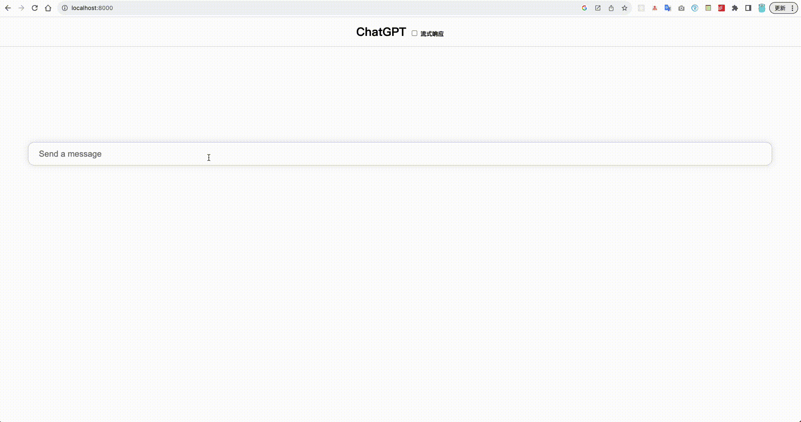

## Django ChatGPT

使用Django框架与ChatGPT通话。




### 运行

使用venv

```bash
$ python3.11 -m venv ./venv
$ . ./venv/bin/activate
$ pip3 install -r requirements.txt
```

运行程序

```bash
# 访问openai服务器要设置代理
$ export HTTPS_PROXY=socks5://localhost:1087
# 设置API KEY
$ export API_KEY=sk-xxxxxxxxxx
$ ./chatgpt/manage.py runserver
```

在浏览器打开`http://localhost:8000`访问页面。
